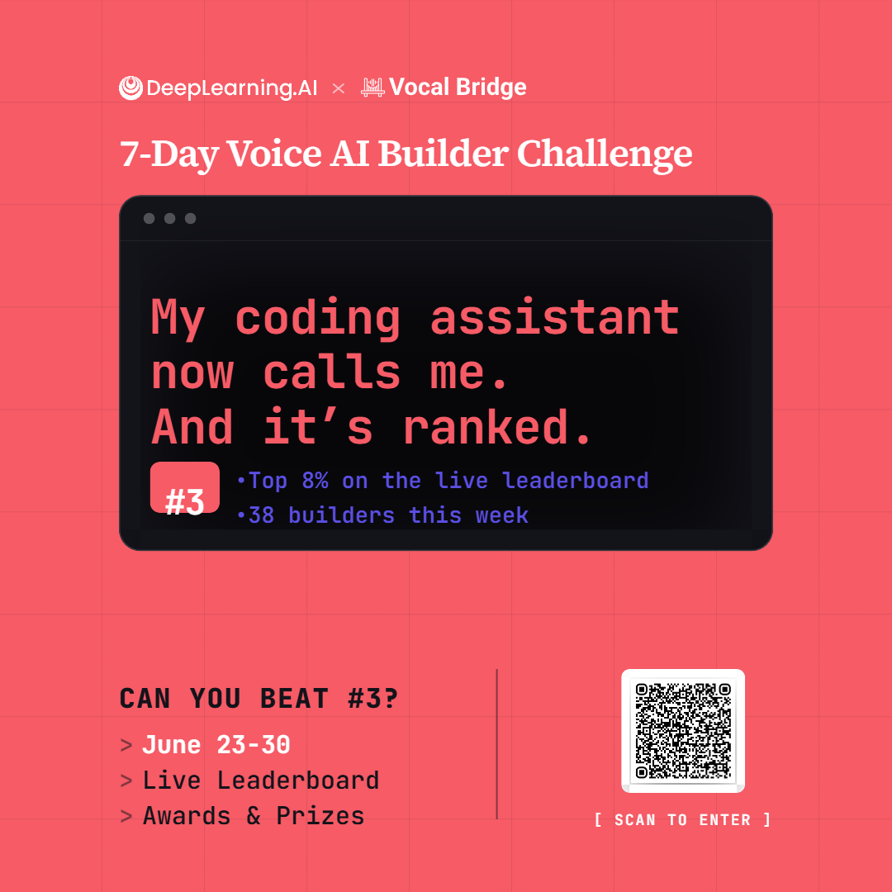

# Voice Escalation via Vocal Bridge

**7-Day Voice AI Builder Challenge** — DeepLearning.AI × Vocal Bridge

I taught my coding assistant to call me for high-stakes decisions — and only then.

---

## Ranking

<p align="center">
  
</p>

| Metric | Score |
|--------|-------|
| **Final rank** | **#3** of 38 builders |
| **Percentile** | Top **8%** |
| Challenge | June 23–30, 2026 |
| Part 1 (`SKILL.md`) | **47/50** (raw) · **40** curved (top Skill band) |
| Part 2 (demo video) | **37/50** (raw) · **38** curved |
| Combined (leaderboard) | **78** |

---

## What this project is

A voice-escalation skill for coding agents: escalate by **voice** only when a human decision is required (destructive actions, ambiguous specs, missing credentials, prod deploy without rollback).

Built on [Vocal Bridge](https://vocalbridgeai.com) for real-time voice calls and transcripts.

### Repo contents

| File | Purpose |
|------|---------|
| [`SKILL.md`](./SKILL.md) | Part 1 submission — when to call, how to speak, fail-safe + multi-turn state |
| [`prompt.txt`](./prompt.txt) | Nate (Vocal Bridge agent) system prompt for the demo call |
| [`demo_agent.py`](./demo_agent.py) | Demo script used in the video (deploy blocker → voice decision) |
| Demo video | Screen recording of the end-to-end escalation loop |
| `vocal-bridge-rank.png` | Official share card — **#3** ranking |

---

## Demo video

**Watch the recording in this repo:**

➡️ [`demo.mp4`](./demo.mp4)

**What the video shows**

1. Terminal runs pre-deployment checks  
2. Agent detects **no rollback plan** → escalates via Vocal Bridge  
3. Developer joins Nate on the web call  
4. Nate presents Option 1 / Option 2  
5. Developer says **"one"** or **"two"**  
6. Terminal confirms the decision and acts safely  

---

## Part 1 — `SKILL.md` highlights

- **Discriminate** — call only for high-stakes blockers (not linter/style noise)  
- **Contextualize** — decision-first spoken messages (stakes + 2 options)  
- **Execute** — fail-safe on silence / unclear / abort  
- **Hold state** — one call per blocker; chat can replace a missed voice answer  

Best Part 1 score: **47/50**.

---

## Run the demo locally (optional)

```powershell
# SSL fix (Windows)
$env:REQUESTS_CA_BUNDLE = python -c "import certifi; print(certifi.where())"

cd "path\to\this\repo"
copy .env.example .env   # add your Vocal Bridge API key + agent ID
pip install python-dotenv requests certifi

python demo_agent.py
```

Then open [vocalbridgeai.com/app/dashboard](https://vocalbridgeai.com/app/dashboard) → **Nate** → **Start call** → say **one** or **two**.

---

## Challenge

- **Event:** [7-Day Voice AI Builder Challenge](https://vocalbridgeai.com/app/challenges/voice-escalation)  
- **Organizers:** DeepLearning.AI × Vocal Bridge  
- **Dates:** June 23–30, 2026  

---

## Author

**Francis Natus Mugisha** (South Korea)

---

## License

MIT — feel free to reuse the skill patterns for your own agents.
